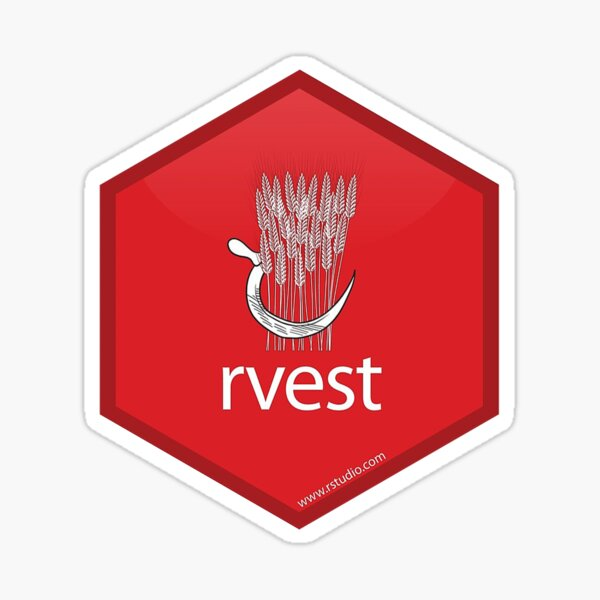

```{r xaringan-themer, include=FALSE, warning=FALSE}
library(xaringanthemer)
style_mono_light(
  base_color = "#042856", 
  header_color = "#7cacd4",
  title_slide_text_color = "#7cacd4",
  link_color = "#0000FF",
  text_color = "#000000",
  background_color = "#FFFFFF",
  header_h1_font_size ="2.00rem"
  )
```

```{r xaringan-scribble, echo=FALSE}
xaringanExtra::use_scribble() #activate for the pencil
xaringanExtra::use_panelset() #panel set
```


```{r, echo=FALSE, purl=FALSE, message = FALSE}
knitr::opts_chunk$set(comment = "#>", purl = FALSE, fig.showtext = TRUE, out.width="40%", retina = 2)
```


class: left

# Homework I review

- Turn off warnings and messages in code chunks. It does not look good when you render the documents.
- Do not show whole big data, show a piece of it. 
- Do not use View() function in homework/reports since if it forces to open another window.
- library(tidyverse) already involves library(ggplot2) etc. If you write them sequentially, this implies that
you do not know the tidyverse ecosystem well.
- Please, do commenting as needed (short comments). The reader does not have to guess what you are doing. You need to navigate the reader.
- Present a well-organized homework/report. This is a sign how you respect your readers.
- Please, do use data science related packages' functions for mathematical operations. 
- Please, prefer piping as needed, it increases the code's readability.
- Please, pay attention your project folder design. Keep data related files under data folder, keep image
related files under image file etc. 
- As in everything, how you present something matters as what you have done.
---
class: left

<!-- First code block is setting options for theme of the slides  -->  


# Outline

* Motivation.
* What is `Web Scraping`?
* `HTML` basics.
* Web scraping with `rvest` package.
* Ethical issues.
* 01-web_scraping.Rmd.

---

# Motivation

```{css echo=FALSE}
.pull-left {
  float: left;
  width: 50%;
}
.pull-right {
  float: right;
  width: 50%;
}
```

.pull-left[
```{r echo=FALSE, out.height='100%', out.width='90%'}
knitr::include_graphics('images/hatem_crime_stat.jpeg')  
```
[Source](https://www.statista.com/chart/24442/anti-asian-hate-crime/)
]

.pull-right[
* "A survey of police reports by the [Center for the Study of Hate and Extremism at California State University](https://www.csusb.edu/sites/default/files/FACT%20SHEET-%20Anti-Asian%20Hate%202020%203.2.21.pdf) confirmed that racially motivated crimes against those of Asian descent in the U.S. have risen in the pandemic year of 2020. **While hate crimes against Asians still make up a smaller fraction of all hate crimes reported in America’s 15 largest cities, their number rose from 49 in 2019 to 122 in 2020.**"
* "Separate reports released by the [Stop AAPI Hate](https://stopaapihate.org/) reporting center confirm that attacks on Asians were highest in the early days of the pandemic, but also show that they have been rising again lately."
* "[Stop AAPI Hate](https://stopaapihate.org/) said yesterday that verbal harassment was the most common incident recorded by them at 68 percent of all cases, followed by deliberate shunning (20 percent of cases) and physical attacks (11 percent of cases)."
]

---
# What is a hate crime?
- According to the [US Department of Justice](https://www.justice.gov/hatecrimes/learn-about-hate-crimes/chart): A hate crime is a crime committed on the basis of the victim’s perceived or actual race, color, religion, national origin, sexual orientation, gender, gender identity, or disability.
- The [US Department of Justice](https://www.justice.gov/hatecrimes/learn-about-hate-crimes/chart) adds: "Hate crimes have a broader effect than most other kinds of crime. Hate crime victims include not only the crime’s immediate target but also others like them. Hate crimes affect families, communities, and at times, the entire nation, as **others fear that they too could be threatened, attacked, or forced from their homes, because of what they look like, who they are, where they worship, whom they love, or whether they have a disability.**"

[Source](https://www.usatoday.com/story/news/politics/2021/03/18/hate-crime-attacks-georgia-raise-motive-bias-questions/4739328001/)

---
# Why report hate crimes?

- According to the [US Department of Justice](https://www.justice.gov/hatecrimes/learn-about-hate-crimes/chart): "The Hate Crimes Reporting Gap is the **significant disparity** between hate crimes that actually occur and those reported to law enforcement. It is **critical to report hate crimes** not only to show support and get help for victims, but also to send a clear message that the community will not tolerate these kinds of crimes. Reporting hate crimes allows communities and law enforcement to fully understand the scope of the problem in a community and put resources toward preventing and addressing attacks based on bias and hate."

---
# Lacking Hate Crime Data

```{css echo=FALSE}
.pull-left {
  float: left;
  width: 50%;
}
.pull-right {
  float: right;
  width: 50%;
}
```

.pull-left[
```{r echo=FALSE, out.height='100%', out.width='90%'}
  
```
[Source](https://www.theguardian.com/us-news/datablog/2021/mar/20/asian-american-hate-crime-data-mona-chalabi?utm_source=dlvr.it&utm_medium=twitter)
]

.pull-right[
* "This, of course, ignores the possibility that someone might be motivated by racial hatred and sexism."
* "Unfortunately, most statistics make the same assumption. Hate crime data that is gathered by the FBI is often categorized according to **a single motivation** (such as religion, sexual orientation, race/ethnicity, gender identity). Less than 3% of the hate crimes that were reported in 2019 recorded **multiple biases.**"
* "**Reality is obviously much more complex than these numbers capture.** Things get even more complicated when you consider reporting rates. A person’s race and gender identity will affect the likelihood that they will report a hate crime to the police."
]


---
# Motivating Data
- The data we need to answer a question may not always come in a spreadsheet and be ready for us to read. Sometimes, data can be available on the web.
- For example, following [Wikipedia page](https://en.wikipedia.org/wiki/Hate_crime_laws_in_the_United_States) illustrates **Hate crime statistics by bias motivation in the US** in a `html` table:

```{r echo=FALSE, out.width='100%'}
  
```

---
# Web Scraping 
- **Web scraping** or **web harvesting** are the terms used to describe the process of extracting data from a website. 
- The **web pages** are written in a **text** format using **hyper text markup language** (HTML) code.
- Afterwards, they are rendered by **web browsers** to be viewed.
- To see the `HTML` source code for a web page we can visit the page on the _browser_, then we can use the _View Page Source_ tool to see it.
- Because `HTML` code is accessible, we can download the `HTML` files, import it into `R`, and then write `R` code to extract the information we need from the page. 


---

- To get an idea of how `HTML` code works, here we show a few lines of code from the [Wikipedia page](https://en.wikipedia.org/wiki/Hate_crime_laws_in_the_United_States) that provides information on US hate statistics:

--
```{r echo=FALSE, out.height='100%', out.width='100%'}
  
```

--

```{r echo=FALSE, out.height='100%', out.width='100%'}
  
```


---

- Once we look at the full `HTML` source code, we can actually see the text and data along with `HTML` codes. 
- We can also see **a pattern** of how it is stored. If you know `HTML`, you can write programs that leverage knowledge of these patterns to extract what we want. 
- We also take advantage of a language widely used to make web pages look "pretty" called Cascading Style Sheets (CSS).

---
# HTML basics

- All `HTML` documents must start with a document type declaration: `<!DOCTYPE html>`.
- Every `HTML` page itself must be in an `<html>` element, and it must have **two children**: `<head>`, which contains document metadata like the page title, author etc and `<body>`, which contains the content you see in the browser. 

.pull-left[
```html
<!DOCTYPE html>
<html>
<head>
  <title>Page title</title>
</head>
<body>
  <h1> Welcome to İTÜ! </h1>
  <p>Some text &amp; <b>some bold text.</b>
  <i> Some italic text </i> </p>
  <a href="http://kutuphane.itu.edu.tr/">Visit İTÜ Library</a> for: 
  <ol>
  <li>Calculus Books</li>
  <li>Engineering Books</li>
  <li>Statistics Books</li>
  </ol>
</body>
</html>
```
]

--
.pull-right[
* Each `HTML` element has a hierarchical structure which consist of a start tag (e.g. `<tag>`), optional attributes (`id='first'`), an end tag (like `</tag>`), and contents (everything in between the start and end tag).
* Block tags like `<h1>` (most important heading 1), `<p>` (paragraph), and `<ol>` (ordered list), `<li>` (list item) form the overall structure of the page.
* Inline tags like `<b>` (bold), `<i>` (italics), and `<a>` (links) formats text inside block tags.
* On the left: The `<a>` tag defines a hyperlink. The `href` **attribute specifies the URL of the page the link goes to**.
]

---

- Note: Since `<` and `>` are used for start and end tags, we cannot use them directly. 
- Instead we have to use the `HTML` escapes `&gt;` (greater than) and `&lt;` (less than). 
- And of couse, since those escapes use `&`, if we want a literal ampersand (and) we have to escape it as `&amp;`.
- If you encounter a tag that you have never seen before, you can find out what it does at [WWW3 school](https://www.w3schools.com/tags/).

---

- Let's try out our `HTML` code at [WWW3 school](https://www.w3schools.com/html/tryit.asp?filename=tryhtml_default):

```{r echo=FALSE, out.height='100%', out.width='100%'}
  
```

- More on [HTML](https://www.w3schools.com/html/html_headings.asp).

---

- Some elements, like `` cannot have children. These elements depend solely on **attributes for their behavior**.

```html

```

- Here, `src` attribute specifies the path (URL) to the image; `width` and `height` attributes define the `width` and `height` of the image in **pixels**.


--


---
# Named attributes
- Sometimes, the start tags of `HTML` elements can have **named attributes** which look like `<tag name1='value1'> Content </tag>`. 
- Two of the most important named attributes are `id` and `class`, which are used in conjunction with `CSS` to **control the visual appearance** of the page. These are often useful when scraping data off a page.
- Note that attributes are always specified in the start tag.

---

#### id attribute

- The `id` attribute is used to point to a specific style declaration in a **style element within head** and the value of the `id` attribute must be **unique** within the `HTML` document.
- The syntax for `id` is: write a hash character (`#`), followed by an `id name`. Then, define the CSS properties within curly braces `{}`.


[Source1](https://www.w3schools.com/html/html_id.asp) and [Source2](https://www.w3schools.com/html/tryit.asp?filename=tryhtml_id_css)

---

#### class attribute

- The `class` attribute is often used to point to a class name in a style sheet. Multiple `HTML` elements can share the same class.
- The syntax for `class` is: write a period character (`.`), followed by an `class name`. Then, define the CSS properties within curly braces `{}`.


[Source1](https://www.w3schools.com/html/html_classes.asp) and [Source2](https://www.w3schools.com/html/tryit.asp?filename=tryhtml_classes_capitals) 
---

- Note that main difference between `id` and `class` attribute is that `id` is unique in a page and can only apply to **at most one HTML element**, while `class` attribute can be applied to **multiple HTML elements**.

---
class: center, middle

# Rvest
<!-- Import image with HTML code, dimensions are in terms of pixel -->
 

---
# The rvest package
- The [rvest package](https://rvest.tidyverse.org/articles/rvest.html) provides web harvesting tools within [tidyverse](https://www.tidyverse.org/packages/) ecosystem.

```{r, message=FALSE, warning=FALSE}
# rvest is not within the core tidyverse ecosystem
# library(tidyverse) will not load rvest package
# load rvest package by library(rvest) call specifically 
library(rvest)
```

- The [rvest manual](https://cran.r-project.org/web/packages/rvest/rvest.pdf) tells us that it depends on a few other packages including  `xml2`. This enables us to use functions available in these packages as well.

|Function        |Description                                   | 
|----------------|----------------------------------------------|
| `read_html()`  |takes a string that can be either a path, a url and then creates a HTML document from a webpage.|

---
- Here are basic `rvest` functions:

|Function           |Description                                   | 
|-------------------|----------------------------------------------|
| `html_elements()` |select specified elements with the specified tags from the HTML document.|
| `html_table()`    |extract table, to be used after `html_elements()`.       | 
| `html_text()`     |extract text within tags, to be used after `html_elements()`.|  
| `html_attr()`     |extract the value of attribute, to be used after `html_elements()`.| 

---

- The first step in using this package is to import the web page, you are interested in, into `R`. 

```{r}
# Use `read_html()`: to read HTML data from a url or character string into R.
url <- "https://en.wikipedia.org/wiki/Hate_crime_laws_in_the_United_States"
h   <- read_html(url)
h
```

---

- Note that the entire Wikipedia webpage is now contained in `h` object:

```{r}
h
```

- The `h` object  is a _list_ (`R` data type) and the items in the `h` object correspond to the basic document structure of an `HTML` document. 
- Displaying the `h` object shows that the first item in the _list_ is `head`  and the second item is `body`.  
- Note that these items include the basic component of the `HTML` document, in other words, the _text, links_, and HTML "stuff" which were scraped from the web page.  
- Specifically this stuff is found in the _body_ element of the `h` _list_.

---

```{r}
library(xml2)
xml_child(h, 1)
```

---
```{r}
library(xml2)
xml_child(h, 2)
```
---
#### Extract a table
- Now, question is "**how do we extract the table from the object `h`?**" 
- Remember that `HTML` code has a hierarchical tree structure. The different parts of an `HTML` code, often defined with a message in between  `<` and `>`  are referred to as **nodes** (in other words, **tags**).
- When we know that the information is stored in an `HTML table`, we can see this in the `HTML code` with `<table>` tags. 
- To extract a table from the `h` _list_, then we need to gather all the `HTML` code within the `<table>` tags in the `h` _list_. 
- You can learn more about the `<table>` tag structure from [HTML documentation](https://www.w3schools.com/TAGS/tag_table.asp).

---
- The `rvest` package includes functions to extract nodes of an `HTML` document: the function `html_elements()` extracts all nodes of different type and `html_element()` extracts the first one. To extract all tables we use:

```{r} 
wiki_tables <- h %>% 
               html_elements("table")
```

```{r}
# note that in HTML source code there are currently 4 tables!..
# pages are up to change!..
wiki_tables
```


- Now, instead of the entire web page, we just have the `HTML` code for the **tables only**:

---
- But we want the table titled "Victims per Year by Bias Motivation" on the page. 
- Looking at the output above it looks like the **table index** is [3]. To extract just the third table - the table with the data we are interested in - we can type the following:

```{r}
victim_table <- wiki_tables %>% .[3]
# subsetting with square brackets while piping: .[]
victim_table
```

---

- We are not quite there yet because this is **not a data frame**. 
- In fact, `rvest` includes a function just for converting `HTML` tables into data frames:

```{r}
#html_table() #returns a list and get the first component
victim_table_df <- victim_table %>% 
                      html_table()  %>% .[[1]] 
```

```{r, eval=F}
View(victim_table_df)
class(victim_table_df) #returns a data frame
```

---
- We are still not done because this is clearly not a **tidy data set**.

```{r, eval=F}
str(victim_table_df)
```

- Change the column names properly, replace "unknown" and
empty spaces with NA, then remove the commas and turn character variables into numeric.
 
```{r, warning=FALSE, message=F}
library(dplyr)
table_tidy <- victim_table_df  %>% 
               setNames(c("Bias Motive", paste(c(1995:2018), sep=""))) %>% #change the column names to desired character format.
               #mutate_at(vars("1995":"2018"), as.numeric)   #did not work!help needed #NAs did not allow coercion!.. 
               mutate_at(vars("1995":"2018"), funs(gsub(',', '',.))) %>% #remove commas #discuss!!!
               mutate_at(vars("1995":"2018"), as.numeric) #change the columns except bias motive into numeric
               #na_if("unknown") %>% 
               #na_if("") %>% 
#https://github.com/tidyverse/readxl/issues/572  
               ###mutate_at(vars("1995":"2018"), as.numeric) 
# https://stackoverflow.com/questions/46787515/remove-commas-from-character-vectors-based-on-specific-col# umn-names-in-r/46788523
              
```

```{r, eval=F}
#not desired format, but let's continue!.(Some rows should be empty, not NA)
View(table_tidy)
```

---
- Finally, let's get the final look of the table!..

```{r, warning=F, message=F}
#More on HTML tables: https://haozhu233.github.io/kableExtra/awesome_table_in_html.html
library(kableExtra)
table_tidy %>% 
  kbl() %>%
  kable_paper() %>%
  scroll_box(width = "1000px", height = "400px") #add a scroll-box
```

---
#### Exract Text

.panelset[

.panel[.panel-name[Data]
- Let's assume that you want to extract the following unordered list at the [US Department of Justice](https://www.justice.gov/hatecrimes/hate-crime-statistics): 
```{r out.height='100%', out.width='20%'}

```
]

.panel[.panel-name[Code]
```{r }
results <- read_html("https://www.justice.gov/hatecrimes/hate-crime-statistics")
names <- results %>% 
         html_elements("ul") %>% .[10]  #ul: is unordered tag
```

```{r}
names %>% 
         html_text()
#more way to go!..use stringr() package or regular expressions to tidy up this text!..
```
]
]

---

#### Exract image URL
- Let's say we would like to import the image of "ortanca" at https://www.bitkivt.itu.edu.tr/vt/report.php?sor=665 into the `R`.
- This require obtaining image url: http://www.bitkivt.itu.edu.tr/foto/Hydrangea_macrophylla_c%C4%B1cek.sem%C4%B1ha.jpg

```{r, eval=F}
image  <- read_html("https://www.bitkivt.itu.edu.tr/vt/report.php?sor=665")
```

```{r, eval=F}
image_url <- image %>% 
              html_elements("img") %>% .[3] %>%  #we need third image
              html_attr("src") #get image url
```

```{r, eval=F, warning=F, message=F, out.height='100%', out.width='40%'}
#library magick is for image editing (reading, writing, and joining).
library(magick)
magick::image_read(image_url)
```

---
#News

```{css echo=FALSE}
.pull-left {
  float: left;
  width: 50%;
}
.pull-right {
  float: right;
  width: 50%;
}
```

.pull-left[
```{r echo=FALSE, out.height='100%', out.width='100%'}
  
```
]

.pull-right[
```{r echo=FALSE, out.height='100%', out.width='100%'}
  
```

]

---
* [Scribe](https://misinfocon.com/scribes-reference-api-enables-users-to-access-wikipedia-references-b8f749bf60d1) says that: 

   * "We, therefore, started the Scribe credibility API. The goal was to make the   Wikipedia references not only accessible to anyone but also queryable. We implemented this in two steps: (1) extracting Wikipedia references, and (2) setting up an API to query the references."

   * "We extract Wikipedia references from the Wikipedia dump and enrich it with Wikidata information, such as the entity ID in Wikidata. This data is saved as structured data in the database. We focus on online references, i.e., references that include a URL."

 * YOUR TURN?
            
---

```{css echo=FALSE}
.pull-left {
  float: left;
  width: 50%;
}
.pull-right {
  float: right;
  width: 50%;
}
```

# Ethical considerations

- Legal Concerns:
  - If internet data is publicly available (e.g., tweets from a public Twitter account), it is **generally considered legal** to collect this data.
  - Research that involves human participants (e.g., surveys, interviews, blood draws) needs to be approved by the Institutional Ethics Committee.  

---

```{css echo=FALSE}
.pull-left {
  float: left;
  width: 50%;
}
.pull-right {
  float: right;
  width: 50%;
}
```

 - "İTÜ İnsan araştırmaları etik kurulları Sosyal ve Beşeri Bilimler İnsan Araştırmaları (SB-INAREK) ve Sağlık ve Mühendislik Bilimleri İnsan Araştırmaları (SM-INAREK) olmak üzere iki ayrı kuruldan oluşmaktadır."


.pull-left[
```{r echo=FALSE, out.height='100%', out.width='90%'}
  
```
[Source](http://sbinarek.itu.edu.tr/)
]

.pull-right[
```{r echo=FALSE, out.height='100%', out.width='90%'}
  
```

[Source](https://sminarek.itu.edu.tr/)
] 

---

- But it is still not certain whether research about publicly available internet data require Institutional Ethics Committee approval or not.
  
- User Ethics:
  - [According to this information](https://melaniewalsh.github.io/Intro-Cultural-Analytics/Data-Collection/User-Ethics-Legal-Concerns.html):  
"Just because something is legal does not mean it is ethical. Collecting, sharing, and publishing internet data created by or about individuals can lead to unwanted public scrutiny, harm, and other negative consequences for those individuals. There is no single, simple answer to the many difficult questions raised by internet data collection. It is important to develop an ethical framework that responds to the specifics of your particular research project or use case (e.g., the platform, the people involved, the context, the potential consequences, etc.)."  


---

- **Hands-on example:** Visit `01-web_scraping.Rmd` file for data harvesting from craiglist.

```{r echo=FALSE, out.width='90%', fig.cap=''}
  
```

---

- More on web scraping:
  - https://www.r-bloggers.com/2020/01/web-scraping-with-rvest-astro-throwback/
  - https://www.storybench.org/scraping-html-tables-and-downloading-files-with-r/
  - https://cran.r-project.org/web/packages/RSelenium/vignettes/basics.html.  
  

---
# Attributions

- [rvest](https://rvest.tidyverse.org/articles/rvest.html).
- [Data Science Labs](https://raw.githubusercontent.com/datasciencelabs/2020/master/03_wrangling/06_web-scraping.Rmd).
- [Ethics](https://melaniewalsh.github.io/Intro-Cultural-Analytics/Data-Collection/User-Ethics-Legal-Concerns.html).
- [CSS Selectors](https://raw.githubusercontent.com/gulinan/lectures/master/06-web-css/06-web-css.Rmd).


```{r data_pdf, include = FALSE, cache = FALSE, eval = TRUE}
infile = list.files(pattern = 'intro_webscraping.html')
pagedown::chrome_print(input = infile)
```   
